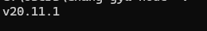

<h1 align="center">
  Next Js개발 환경 세팅 가이드
</h1>

## 👋 이번 포스팅에 대하여

이 블로그의 첫 포스팅은 이전 블로그에서 적으려 했던 Next Js에 대한 주제로 계속 이어나갈까한다. 본래는 모든 내용을 여기로 옮기고 이 블로그를 계속 이어나갈까 생각도 하였지만 그러기에는 워낙 시간이 오래 걸릴 것 같아 velog의 내용을 이어가기로 결정하였다. 만일 이전 블로그의 글이 궁금하다면 위의 header 부분에 존재하는 PrevBlog를 보도록 하자 또한 Next JS에 대한 포스팅은 최종적으로 Mongoose를 이용하여 게시판을 제작하는 것을 목표로 계속 포스팅을 올릴 예정이다.

<br>

## ✍️ 시작하기 앞서 필요한 세팅

Next Js를 하기 위해서는 최신버전의 Node가 깔려 있는지 확인할 필요가 있으므로 cmd에 아래의 명령어를 입력하여 노드가 최신버전 18버전 이상인지 확인하도록 하자

```javascript
node - v;
```

<br>

## ✨ CNA를 통한 Next Js 기본 템플릿 생성

이 블로그는 최대한 이론과 실습을 분리하여 진행할 예정이므로 방법을 설명할때는 최대한 이론을 베재하고 사용방법만을 알려줄 것 이다. 아래의 코드는 리엑트의 CRA와 같이 기본적인 Next Js의 틀을 제공해주는 명령어이니 자신이 Next Js를 생성하고자 하는 위치에서 아래의 명령어를 터미널에 입력하여 생성하도록 하자

```javascript
npx create-next-app@latest
```

아래는 필자의 버전이다 만일 버전을 맞추어 진행하고 싶다면 이 버전에 맞게 nvm을 이용하여 변경하고 진행하도록 하자

  
  <br>

해당 명령어를 입력하면 여러가지 질문이 나올텐데 어렵지 않은 질문들이 나오니 하다보면 나오는 router관련 질문만 제대로 yes 해주도록 하자 그러면 아래의 이미지와 같은 폴더구조를 가진 템플릿이 생성될텐데 각 폴더에 대한 설명은 다음 포스팅에서 이어서 하겠다.


