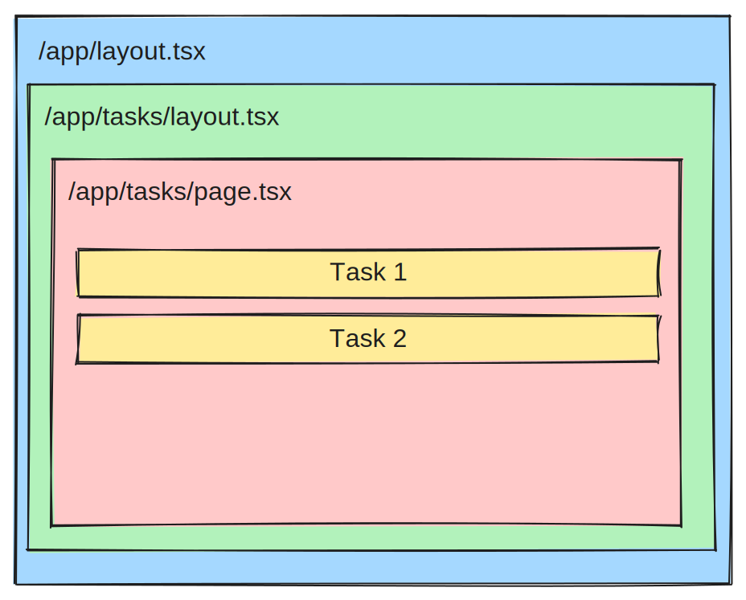

## 👋Next Js 폴더의 역할에 대하여

 

이번 포스팅은 저번 포스팅에서 이야기 한 것 처럼 CNA를 통해 제작한 템플릿의 폴더가 각각 어떠한 역할을 하는지에 대해 알아보겠다.

## ✍️알아볼 폴더의 종류

 

우리가 알아볼 폴더의 구조는 아래의 이미지에서 보이듯 최상위의 파일과 app안의 파일들에 대해 알아 볼 것이다.

  

## ✨ 각 폴더의 역할

 

### 🎲 최상위 폴더

- App : Next Js의 페이지를 구성하는 파일로 가장 상위의 파일이 app이라는 폴더이다 이곳에서 추가적인 라우팅 처리등을 하여 페이지를 생성한다.

 

- node_modules : npm or yarn과 같은 패키지 매니저를 이용하여 다운한 패키지들을 보관하는 폴더이다.

 

- public : 개발시 이미지 폰트등 정적인 요소들이 들어가는 파일이다 이곳에 들어가는 파일들은 번들링시 이름이 변경되지 않고 절대경로를 사용 할 수 있는 이점이있다.

 

- .gitignore : 이 파일은 github에 올라가면 안 되는 민감한 파일들을 등록하여 git을 이용하여 github에 배포시 해당 파일들이 올라가지 않도록 한다.

 

- jsconfig.json : 해당 프로젝트의 각각의 자바스크립트에 공통된 설정을 추가할 수 있는 파일이다.

 

- next.config.mjs : next js의 전체적인 설정을 담다하는 파일이다 서버 및 빌드 단계에서 사용되는 파일로 브라우저 빌드단계에서는 포함되지 않는다( 여기서 브라우저 빌드는 클라이언트 사이드를 의미한다 )

 

- package.lock: 패키지의 버전을 관리하는 파일로 이곳에 명시된 패키지의 버전으로 npm install , yarn install 등을 할때 설치되는 패키지의 버전이 결정된다.

 

### 🧩 app 폴더내 파일

이곳에서 중요하게 보아야 하는 것은 딱 2가지 밖에 없고 나머지는 기본 파비콘 이미지와 css밖에 없어 가장 중요한 2가지만 짚고 넘어가도록 하겠다.

- Layout.js : Next JS에서 컴포넌트를 만들때 사용되는 개념중 하나이다. 아래에서 page.js와 함께 더 자세히 다루도록 하겠다.

- page.js : Next JS에서 LayOut.js 안에서 함께 쓰이며 실질적으로 페이지를 구성하는데 사용되는 파일이다.

 
 

## 🧭 LayOut.js와 Page.js에 대하여

아래의 이미지는 LayOut과 Page에 대한 관계를 나타내는 이미지이다 여기에서 보면 Layout이 Page를 감싸는 형태로 만들어져 있는데 Next Js에서 페이지는 항상 LayOut이 Page를 감싸는 형태로 만들어진다 하지만 하나씩만 만들 수 있는 것이 아닌 이미지에서 알 수 있듯 LayOut을 여러개 생성할 수도 있도 있다.

 

 
 

## 👍 이번 포스팅을 마치며

이번 포스팅에서는 Next Js의 폴더간의 관계와 LayOut, Page의 관계를 알아보았다 다음 시간 부터는 기본적인 라우팅 방법 및 Next Js에서 이미지를 사용하는 특별한 방법 등을 알아보도록 하겠다
