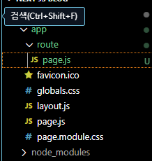
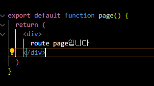
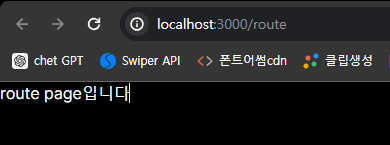
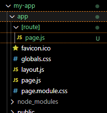
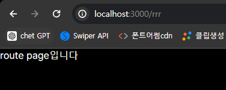

## 🥸 Next Js에서 라우팅에 대하여

저번 포스팅에서는 Next JS의 각 폴더의 역할과 LayOut, Page 의 관계에 대해 간략하게 나마 알아보았는데 이번에는 리엑트를 하던 사람들은 많이 해보거나 들어보았을 라우팅 처리에 관한 내용으로 포스팅을 진행하고자 한다.

#### 라우팅이란?

> 라우팅은 쉽게 말해서 사용자가 요청한 url에 맞는 페이지를 보여 줄 수 있도록 하는 로직을 말하는 것이다. 리엑트에서는 react-router-dom을 사용하는게 일반적이였지만 Next Js는 버전이 업그레이드 되면서 편리하게 라우팅 처리를 할 수 있도록 바뀌었다.

## ✍️ Next Js 14버전 이후의 라우팅 방법( 정적 라우팅 )

우선 Next 14 버전 이상만 해당 라우팅 방법을 사용 할 수 있으며 만약 따라했는데 안 된다면 자신의 Next js의 버전이 14버전 이상인지 부터 확인하도록 하자

- ### 라우팅 경로 폴더 생성

  우선 라우팅 경로를 설정하기 위해서는 page.js가 있는 파일에 로 감싸진 폴더를 하나 생성할 필요가 있다. 필자는 /route라는 url을 입력하면 라우팅이 될 수 있도록 route 라는 이름으로 폴더를 생성해보도록 하겠다.

- ### 폴더 생성

  이미지를 보면 app - [route] - page.js로 구성하였다. 이렇게만하면 /route로 url을 입력시 route안의 page.js가 보이게 된다. page.js는 아래의 이미지와 같이 작성하였다.

  
  

- ### 결과

  이미지와 같이 route 경로로 접근 하였을때 정상적으로 나오는 것을 알 수 있다.

  

## ✍️ 동적 라우팅처리 방법

이번에는 여러개의 페이지를 한번에 생성 할 수 있는 동적 라우팅에 대해 알아보도록 하자 동적라우팅 또한 간단하게 생성이 가능하다.

- ### 동적 라우팅 폴더 생성

  동적 라우팅은 정적 라우팅에서 했었던 폴더 만들기에서 []만 붙여주면 동적으로 생성이 가능하다 바로 아래의 이미지와 같이 생성해보도록 하자

  

   
   
    이미지와 같이 생성 하였다면 정적일때와는 다르게 꼭 /route라고 입력하지 않고 아무거나 입력해도 모두 page.js가 뜨는걸 확인 할 수 있을 것이다.

     
    

- ### 동적 라우팅을 사용하는 이유

  그럼 아무거나 입력해도 page.js가 보이는 동적라우팅을 사용하는 이유는 무엇일까? 그 이유는 우리가 흔히 볼 수 있는 네이버 쇼핑 , 웹툰 사이트 같은 곳을 생각하면 쉽게 이해 할 수 있다. 만약 모두 정적 사이트를 생성 하는 것 처럼 생성한다면 얼마나 많은 폴더를 생성하여야 하는걸까? 웹툰 한개가 100화가 넘는다고 하면 우리는 100개가 넘는 폴더를 생성하여야 할 것이다. 하지만 동적 라우팅을 이용하여 만든다면 사용자가 url에 입력하게 되는 정보 ( 웹툰의 id )등을 이용할 수 있게 되고 하나의 페이지만 생성하여 사용자가 넣은 값에 따라 서버로 요청하는 정보를 다르게 할 수 있게된다.

  결론: 사용자가 url에 넣은 값을 사용 할 수 있게 되어 그 데이터를 서버로 전송하여 값을 받아올 수 있어 훨씬 적은 페이지로 많은 페이지를 생성 할 수 있음

## 👍 이번 포스팅을 마치며

이번에는 라우팅( 정적, 동적 )에 대하여 알아보았는데 다음에는 Next Js에서 제공하는 이미지를 사용하는 방법에 대해 알아볼 것이다.
