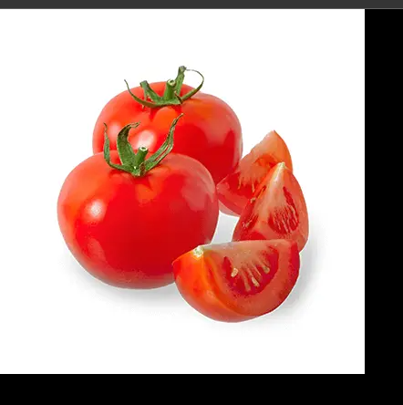
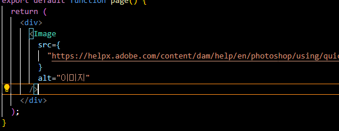
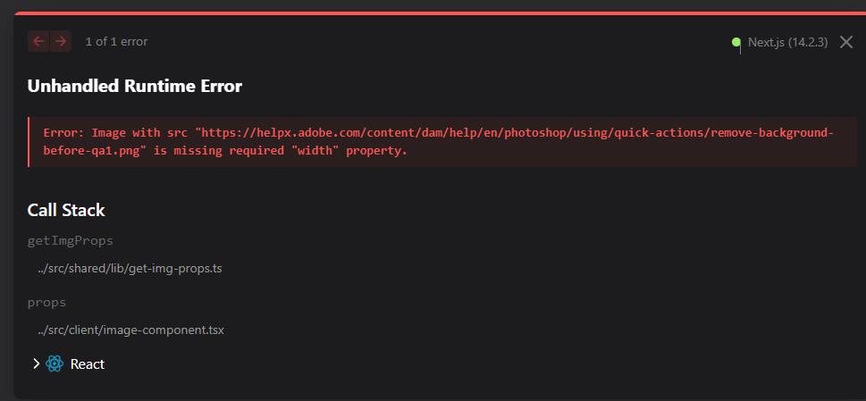
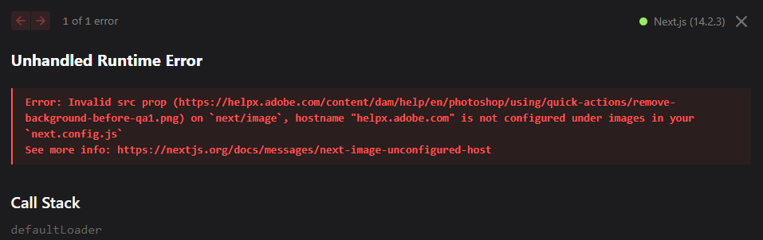
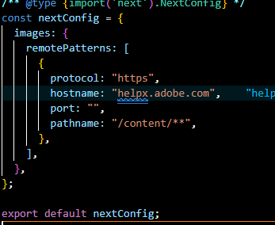
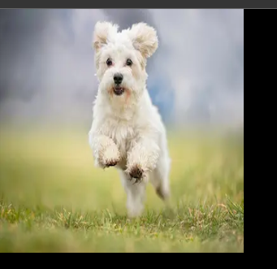

## 😽 NEXT JS 에서 제공하는 이미지 사용법

이번 포스팅은 Next Js에서 제공하는 이미지를 자동윽로 최적화해주는 패키지의 사용법에 대해 알아보겠다. 일반 이미지와 비슷한 사용 방법을 가지고 있으나 외부 이미지를 사용하려할때는 약간의 설정이 필요하니 그 부분만 조심하면 성능개선에 많은 도움이 될 것이다.

## Next Js의 Image 컴포넌트 사용법

이미지 최적화를 위해 Image를 사용하는 방법은 Next Js에서 Image라는 컴포넌트를 import해와서 사용하여야 하는데 아래와 같은 import 구문을 자신의 page.js 혹은 Layout.js에 추가하도록 하자

```javascript
import Image from 'next/image';
```

위와 같이 import한 뒤 해당 컴포넌트를 사용할곳에 적고 img 태그를 사용 하던 것 처럼 src 속성 및 alt 속성을 추가한다. 하지만 여기서 src 경로는 이미지와는 다르게 넣어야 하는데 img 태그는 src에 경로를 직접넣는 반면 Image 컴포넌트는 이미지를 import로 가져와서 import한 이미지를 넣어야한다.

```javascript
                                  Image 컴포넌트 사용
  import Image from "next/image";
  import img from "/public/food0.png";
  export default function page() {
    return (
      <div>
        <Image src={img} alt="이미지" />
      </div>
    );
}
```

```javascript
                                  img 태그 사용
  import Image from "next/image";
  import img from "/public/food0.png";
  export default function page() {
    return (
      <div>
      
      </div>
    );
}

```

## 🐈 출력결과

아래와 같이 잘 출력되는 것을 확인 할 수 있다.



## 🐇 사용시 주의 점

이 컴포넌트는 몇가지의 주의 점이 있는데 우선은 가장 위에서 말했던 외부의 이미지 경로를 사용하여 출력할때이다 외부의 이미지를 출력하게 되면 속성 값에 width height 값의 지정이 필요로 하며 next-config.js에 추가적인 설정이 필요하다.

참고 사이트 : https://nextjs.org/docs/app/building-your-application/optimizing/images#remote-images

- 외부 url 사용시 추가적인 width, height 속성 지정이 필요함
- 외부 url을 next-config.js에 등록할 필요가 있음

## 🐿️ 외부 이미지를 사용해보기

외부 이미지 사용은 어려운게 없지만 글로만 읽으면 이해하기 힘들 수 있으니 직접 해보는 것을 추천한다. 우선 필자는 인터넷에 아무 이미지를 사용할 예정이다.

필자는 아래의 url을 사용한다

> https://vercel.com?utm_source=create-next-app&utm_medium=appdir-template&utm_campaign=create-next-app

- ### width, height 속성 추가

  아래는 url을 추가하고 width height값을 지정 하지 않은 모습이다
  
  

  이제 여기에 width 와 height값을 추가해보도록 하자

  <br>

- ### width와 height를 추가해도 생기는 오류

  현재 width와 height 값을 추가하였지만 위에서 말한 next-config.js를 설정하지 않아 오류가 나는 모습이다. 한번 config의 설정을 추가해보자

   

   <br>

  위의 Next 공식문에 따라 외부 url의 정보를 기입해보면 아래와 같이 작성하게 될 것이다. 이 부분은 url을 공부해본적이 있다면 쉽게 알 수 있을 것이다.

   

  ### 결과화면

   
