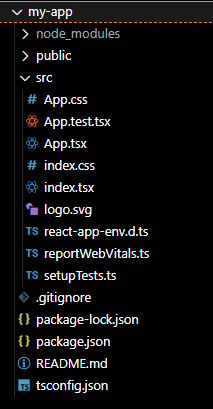

## 😾 타입스크립트 기본 세팅

이번 포스팅은 리엑트에서 타입스크립트를 사용하는 방법에 대해 알아보도록 하겠다. 타입스크립트가 무엇인지는 알고 있다고 생각하고 진행할 예정이라 따로 타입스크립트에 관한 만들어지게 된 계기 같은건 설명하지 않고 이번에도 사용 방법을 위주로 쭉 포스팅을 하게 될 것이다.

## 리엑트에서 타입스크립트 세팅하는법 ( CRA로 간편하게 )

이번 포트팅의 가장 핵심은 세팅하는 방법에 대해 알아보자 세팅은 CRA를 사용하여 기본적은 템플릿을 받아오는 방법을 사용할 것이다. (수동으로 하는 방법은 추후 업로드 예정)

리엑트에서 연습용 폴더 하나를 만들고 아래와 같이 입력하여 새로운 리엑트 템플릿을 생성하자.
<br>
생성이 완료 되었다면 jsx 확장자가 아닌 컴포넌트 파일들이 모두 tsx 확장자로 바뀐 것을 확인 할 수 있을것이다.

```javascript
npx create-react-app [사용할 폴더 이름] --template typescript
```

<hr>

## 성공시 파일 구조



## 😽 포스트를 마치며

다음 포스트는 타입스크립트의 타입에 관한 포스팅을 진행하도록 하겠다.
