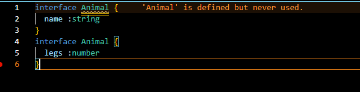
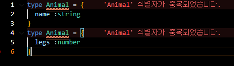

## 🐎타입스크립트에서 타입을 선언하는 2가지 방법

타입스크립트에서는 타입을 변수처럼 사용하기 위한 방법이 2가지가 있다. 2가지에는 큰 차이는 없으나 그 차이점에 대해서는 알아둘 필요는 있다 생각하여 함께 이번 포스팅에 함께 적도록 하겠다.

## 🐈‍⬛ 첫 번째 방법 type

type은 interface가 나오기 이전부터 있던 타입의 선언 방법이다. 사용방법은 아래와 같다

```javascript
type 타입이름 = 지정할 타입
```

이렇게만 보면 잘 이해가 안가니까 몇 가지의 예시를 들어보도록 하겠다.

```javascript
type 문자열 = string

type 숫자 = number

type 유니언타입 = string | number

type 객체타입 = {
  a : number
  b : string
}
```

이런식으로 자신이 원하는 이름과 타입을 형식에만 맞게 써주면 된다. 이렇게 만든 타입은 앞선 포스팅에서 사용했던 것 처럼 변수 오른쪽에 :을 붙여 사용 하면 된다.

```javascript
let 변수: 문자열 = 'string';
```

## 🐯 두 번째 방법 interface

interface는 타입을 정의하는 두번째 방법이며 type 다음으로 나온 최신 문법이기도 하다. interface의 사용 방법은 type과 거의 동일하여 특별히 어려운점은 없다.

```javascript
interface 타입이름 지정할 {지정할 타입}
```

위의 코드에서 이상함을 느낄 수 있는데 interface는 type과 다르게 = 을 사용하지 않고 객체를 생성할때만 사용 할 수 있는 키워드이다. 그래서 {}가 필수다. interface로 여러 타입들을 선언해보자

```javascript
interface 객체타입1 {
  a : string
  b: number
}

interface 객체타입2 {
  a : any,
  b: unknown
}

interface 객체타입3 {
  a : {
    b: string
  }
}
```

위의 예제처럼 {}안에 자신이 원하는대로 혹은 받아야하는 데이터의 형태대로 설정하여 사용하면 된다.

## 🦄 type과 interface 무엇이 다를까?

type과 interface 2가지의 차이점이 존재하는데 첫 번째는 타입 중복선언시의 차이점과 상속을 할때의 차이점이있다.

### 🦏 타입 상속의 방법

아래는 interface에서만 사용할 수 있는 상속의 방법며 type에서는 extends를 사용하지 못한다. 하지만 interface는 &기호를 사용하여 type과 똑같이 사용이 가능하다

```javascript
interface Animal {
  name: string;
}

interface Cat extends Animal {
  legs: number;
}
```

type에서 상속을 하고 싶으면 &를 사용해야한다 ( &를 사용하는 것을 intersection이라고 부른다 )

```javascript
type Animal = {
  name: string,
};
type Cat = Animal & { legs: number };
```

### 🦫 타입 중복선언시

interface 에서는 타입의 이름이 중복으로 선언이 되면 오류가 생기지 않고 상속되어 나온다. 반면 type으로 작성된 타입은 중복을 허용하지 않는다.

```javascript
interface Animal {
  name :string
}
interface Animal {
  legs :number
}

마치 extends가 된 것 처럼 동작하여 Animal안에 name과 legs가 둘다 들어감
```



```javascript
type Animal = {
  name :string
}
type Animal = {
  legs :number
}
타입의 이름이 중복되어 오류가 발생함
```


