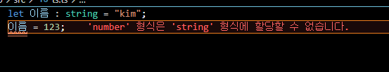

## 🙋‍♀️ 타입스크립트 타입의 종류 중요한가..?

이번 포스팅은 타입스크립트의 타입의 종류에 관한 포스팅이다. 당연한 말이지만 타입스크립트에서는 타입을 아는 것이 굉장히 중요하다 자신이 타입스크립트를 사용할때도 물론 중요하지만 요즘같이 대부분 타입스크립트를 프로젝트에 도입하는 추세에서는 다른사람의 코드를 읽기 위해서 사실상 타입스크립트를 아는 것은 반필수라고 생각한다. 물론 타입만 안다고 읽을 수 있을정도로 간단하지는 않지만 기본적인 타입과 union, any등을 모르면 읽을 엄두도 낼 수 없기에 이런 기초적인 타입일 수록 정말 중요하다.

## 👨‍🍼 타입스크립트의 타입의 종류

타입스크립트는 변수를 만들때 타입의 지정이 가능하다.

```javascript
let 이름: string = 'kim';
```



위의 코드는 값으로 string 형태의 값만을 받는다는 의미의 변수이다. 정말 간단하게

> 변수 : 타입

만약 다른 타입의 값을 대입하려고 시도한다면 에러를 띄우는 모습을 볼 수 있다.

형태로 지정만하면 쉽게 타입을 지정할 수 있고 변수의 이름도 직관적이기 때문에 금방 익힐 수 있다. 바로 어떤 타입들이 있는지 알아보도록 하자

```javascript
let 문자열: string = ''; // 문자열

let 숫자: number = 123; // 숫자

let 문자만을가지는배열: string[] = ['string']; // 배열안의 원소로 문자열만 사용 가능

let 숫자만을가지는배열: number[] = [1]; // 배열안의 원소로 숫자만 사용가능

let 유니언1: string | number = 1; // 숫자또는 문자열 가능 ( 2가지 타입이 혼합되어 만든 새로운 타입 = union 타입 )

let 유니언2: string | number = '문자'; // 숫자또는 문자열 가능 ( 2가지 타입이 혼합되어 만든 새로운 타입 = union 타입 )

let 모든타입가능: any = ''; // 아무타입이나 사용 가능 but 다른 타입의 제한도 무시함

let 언노운: unknown = ''; // any와 똑같이 모든 타입이 가능하지만 다른 타입의 제한을 무시 x

type NameType = 'kim' | 'park'; // literal type 이라고 부르며 이 타입이 사용된 변수에는 'kim' 또는 'park' 밖에 들어올 수 없다.
let 리터럴: NameType = 'kim';
```

타입은 기본적으로 위와 같이 존재하며 조금만 사용하다 보면 금방 익숙해 질 수 있다.

## 포스팅을 마치며

이번에는 기본적인 타입들에 대해 알아보았다 다음 포스팅에서는 타입을 변수처럼 사용하기 위해 타입을 지정하는 2가지 방법에 대해 알아보겠다.
